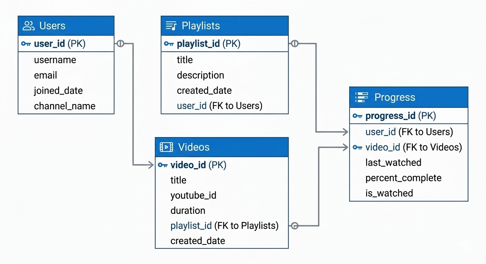

# 📺 YouTube Learning Platform Backend

A production-ready microservices ecosystem that transforms YouTube content into a structured learning environment. Featuring automated syncing, progress persistence, and an intelligent recommendation engine.

---

## 🚀 Quick Start & Setup

To run this backend locally, you will need **Docker** and a **YouTube Data API v3 Key**.

### 1. Get a YouTube API Key

Since this platform automatically syncs course content directly from YouTube, it requires an API key:

1. Go to [Google Cloud Console](https://console.cloud.google.com/).
2. Create a new project and enable the **YouTube Data API v3**.
3. Generate an API Key under **Credentials**.

### 2. Configure Environment Variables

1. Clone this repository.
2. In the root directory, locate the `.env.example` file.
3. Copy it and rename the copy to `.env`.
4. Open the new `.env` file and insert your API key:
   ```env
   YOUTUBE_API_KEY=your_actual_api_key_here
   ```

### 3. Launch with Docker Compose

Run the following command in the root directory. Docker will automatically build the images, spin up 5 isolated PostgreSQL databases, and start the 5 FastAPI microservices along with the API Gateway.

```bash
docker-compose up --build -d
```

_You can now access the interactive API Documentation at: `http://localhost:8000/docs`_

---

## 🏗️ Technical Architecture


The system consists of 5 independent microservices orchestrated via an **API Gateway (Port 8000)**. The Gateway routes all traffic using a proxy pattern so the frontend only needs to speak to a single unified URL (`localhost:8000`).

| Microservice          | Internal Port | Description                                                                                                               |
| :-------------------- | :------------ | :------------------------------------------------------------------------------------------------------------------------ |
| **User Service**      | `8001`        | Manages learner identity profiles.                                                                                        |
| **Content Service**   | `8002`        | Integrates with YouTube API to fetch and cache Playlists/Videos.                                                          |
| **Progress Service**  | `8003`        | Tracks watch-time, resume points, and course completion.                                                                  |
| **Analytics Service** | `8004`        | Logs background interaction events (play, pause, seek), tracking drop-offs and platform popularity.                       |
| **Recommend Service** | `8005`        | Acts as the "brains" of the platform, advising the user what video to watch next based on cross-service data constraints. |

---

## 🛠️ Complete Developer API Reference

_(All requests should be made to the API Gateway at `http://localhost:8000`)_

### 👤 User Module (`/users`)

| Method | Endpoint           | JSON Payload / Notes                                                                               |
| :----- | :----------------- | :------------------------------------------------------------------------------------------------- |
| `POST` | `/users`           | `{"email": "learner@example.com"}`<br>_Returns a unique user ID required for subsequent requests._ |
| `GET`  | `/users`           | Returns a paginated list of all registered users.                                                  |
| `GET`  | `/users/{user_id}` | Returns a single user profile.                                                                     |

### 📚 Content Module (`/playlist`, `/video`)

_Note: This service uses a Cache-First pattern. Hitting a GET endpoint for the first time natively acts as an "Add to database" trigger._
| Method | Endpoint | JSON Payload / Notes |
| :--- | :--- | :--- |
| `GET` | `/playlist/{playlist_id}` | Provide a YouTube Playlist ID. The backend will instantly import all videos to the DB. |
| `GET` | `/playlist/all` | Returns a paginated list of all imported courses. |
| `GET` | `/playlist/search?q={query}` | Search for YouTube playlists by query string. Returns matching playlists with metadata. |
| `GET` | `/video/metadata/{video_id}` | Provide a single YouTube Video ID. Returns the title, duration, and **a ready-to-use HTML iframe embed code**. |
| `GET` | `/video/next/{video_id}` | Returns the chronological next video in the sequence. |

### 📈 Progress & Tracking Module (`/video/progress`, `/course`)

| Method | Endpoint                                        | JSON Payload / Notes                                                                                                                                                           |
| :----- | :---------------------------------------------- | :----------------------------------------------------------------------------------------------------------------------------------------------------------------------------- |
| `POST` | `/video/progress`                               | `{"user_id": "uuid", "video_id": "yt_id", "watched_seconds": 120, "event_type": "pause"}`<br>_This modifies progress AND triggers a background task to the Analytics Service._ |
| `GET`  | `/video/resume/{video_id}?user_id={id}`         | Returns exactly what second the user left off at (or 0 if completed).                                                                                                          |
| `GET`  | `/course/{playlist_id}/progress?user_id={id}`   | Returns course-wide stats (e.g. "Completed 3/10 videos").                                                                                                                      |
| `GET`  | `/course/{playlist_id}/completion?user_id={id}` | Returns an assessment boolean `course_completed: true` if watched > 90%.                                                                                                       |
| `POST` | `/video/note`                                   | `{"user_id": "uuid", "video_id": "yt_id", "content": "note text", "video_timestamp": 45}`<br>_Persists a timestamped note for a specific video._                               |
| `GET`  | `/video/notes?user_id={user_id}&video_id={vid}`  | Returns all notes for a specific video.                                                                                                                                        |
| `POST` | `/video/bookmark/toggle`                        | `{"user_id": "uuid", "video_id": "yt_id"}`<br>_Toggles the bookmark status for a video._                                                                                       |

### 📊 Analytics Module (`/analytics`)

| Method | Endpoint                        | JSON Payload / Notes                                                                       |
| :----- | :------------------------------ | :----------------------------------------------------------------------------------------- |
| `GET`  | `/analytics/dropoff/{video_id}` | Indicates the exact second in the video where the majority of users click "pause" or skip. |
| `GET`  | `/analytics/popular?limit=10`   | Generates a platform-wide leaderboard based on Play events and Completion rates.           |

### 🤖 Recommendation Module (`/recommend`)

| Method | Endpoint                                | JSON Payload / Notes                                                   |
| :----- | :-------------------------------------- | :--------------------------------------------------------------------- |
| `GET`  | `/recommend/{playlist_id}?user_id={id}` | The engine decides your next lesson. Read below for the Logic details. |

---

## 🧠 Business Logic & Database

### Database Schema (ERD)

The platform embraces true microservice data-isolation ("Database-per-service"). There are no foreign keys shared across databases; relationships are loosely coupled via `user_id` and `video_id` UUID strings.



### The Recommendation Engine Decision Tree

Rather than forcing the frontend to figure out what a user should do next, the Recommendation service aggregates data centrally:

1. **Check for Unfinished Videos:** Does the user have a video paused midway? `-> Recommend they resume.`
2. **Check for Next in Sequence:** Did they just finish Lesson 1? `-> Recommend Lesson 2.`
3. **Check Global Popularity:** Have they finished the whole course? `-> Ask the Analytics Service for the highest trending platform video and recommend that.`


---

## � Deployment Overview


The application utilizes Docker-Compose to spin up an internal `bridge` network (`youtube-net`).
All services are bound to this network and refer to each other natively using hostname resolution (e.g. `http://user-db:5432` or `http://content-service:8002`). The only port exposed to the public host machine is the API Gateway on `:8000`.
